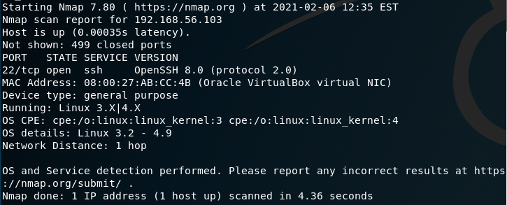
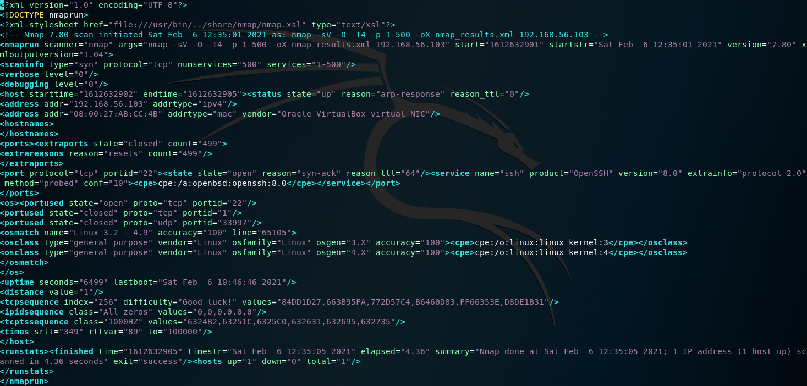
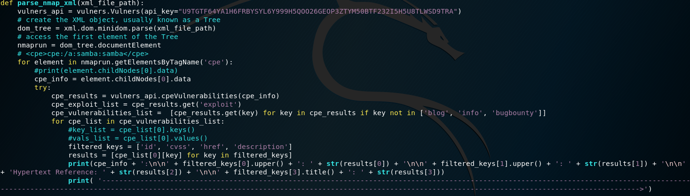
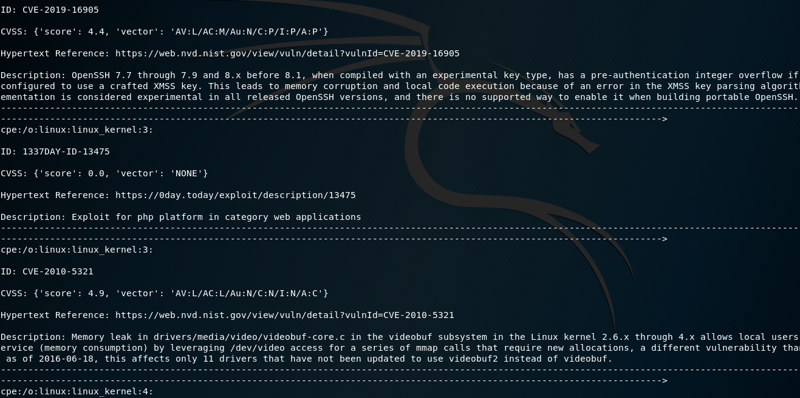
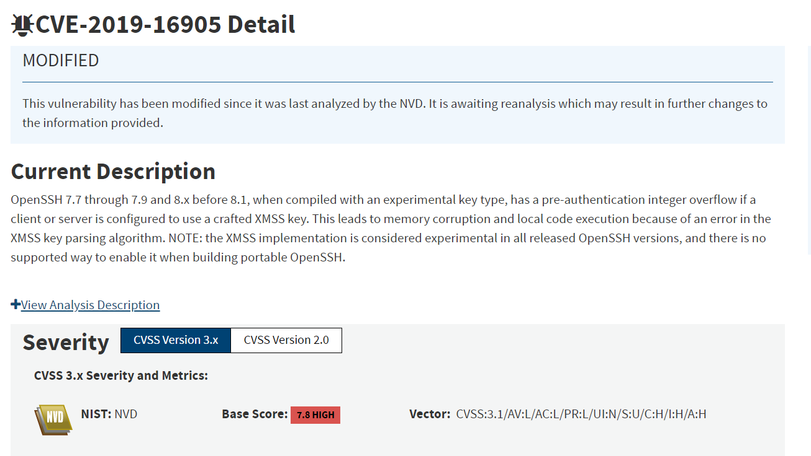

# Vulner's Report

Vulners-Report is a powerful and highly effective tool for vulnerability assessment and management. It provides users with a comprehensive overview of potential security threats and offers actionable insights to mitigate them. With Vulners-Report, users can easily identify vulnerabilities across their entire network and prioritize remediation efforts based on the severity of the issue.

#
# Run down of the Script

The user is first prompted for an IP Address, this Python script then utilizes the Nmap scanner and the Vulners API to perform vulnerability scanning and generate reports. Specifically, the script performs the following actions:

**Nmap Scan**

It uses the subprocess module to execute an Nmap scan with the following options:

-sV: Enables service version detection.
-O: Enables OS detection.
-T4: Sets the timing template to aggressive.
-p: Specifies the port range to scan.
-oX: Outputs the results in XML format to a file.

**Parsing the XML File**

We then parse the resulting XML file using the xml.dom.minidom module. 

For each CPE (Common Platform Enumeration) string found in the XML file, it calls the Vulners API's cpeVulnerabilities() method to obtain a list of vulnerabilities associated with that CPE.

**Output of the CPE Information**

Now that we have the CPE information, We will use the Vulner's API database to check for any CVE's and once we have that information it is about simplifying it so that it can be easily read.  We decided to only show specific info about the CVE's to not overwhelm our program or the user.  We went with showing the ID, the CVSS, the hypertext reference, and then the description so you would know a little more about the CVE for diving any deeper.

**Using the Hypertext Reference for Solutions**

The main reason we output the Hypertext Reference is so that the user can go to that URL and read more about the specific CVE as well as posted solutions on how to fix it.  You can see an example of this below.

**Extra Notes**

Testing with this script was done on a local host network using VM's provided to us by Fullstack Academy.  Currently, this version of script only works on Linux based OS's.  https://github.com/vulnersCom/api is Vulner's Github for different ways to use their database for your needs.  https://vulners.com/search?query=!bulletinFamily:ioc%20order:published is a link to the Vulner's Database if you are interesting in looking at what vulnerabilities they are reporting daily.

