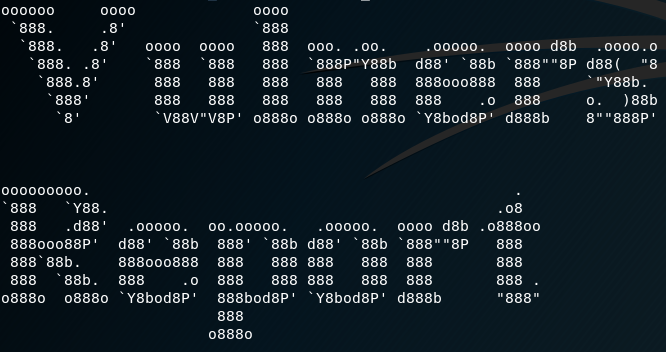

# Vulner's Report

Vulners-Report is a powerful and highly effective tool for vulnerability assessment and management. It provides users with a comprehensive overview of potential security threats and offers actionable insights to mitigate them. With Vulners-Report, users can easily identify vulnerabilities across their entire network and prioritize remediation efforts based on the severity of the issue.

#
# Run down of the Script

The user is first prompted for an IP Address, this Python script then utilizes the Nmap scanner and the Vulners API to perform vulnerability scanning and generate reports. Specifically, the script performs the following actions:

**Nmap Scan**

It uses the subprocess module to execute an Nmap scan with the following options:

-sV: Enables service version detection.
-O: Enables OS detection.
-T4: Sets the timing template to aggressive.
-p: Specifies the port range to scan.
-oX: Outputs the results in XML format to a file.

**Parsing the XML File**

We then parse the resulting XML file using the xml.dom.minidom module. 

For each CPE (Common Platform Enumeration) string found in the XML file, it calls the Vulners API's cpeVulnerabilities() method to obtain a list of vulnerabilities associated with that CPE.

**Outputting CPE Information**

It extracts relevant vulnerability information from the resulting dictionary and prints it to the console in a readable format.

The script also includes error handling for invalid CPE strings and uses the vulners module to simplify the process of accessing the Vulners API.

**Improving CVE Remediation Efforts with Hypertext References**

One of the primary reasons for including the Hypertext Reference in the output is to provide the user with a direct URL to access additional information about the specific CVE, as well as potential solutions to fix it. An example of how this information is presented can be found below.

**Extra Notes**

We conducted testing for this script on a local host network using VMs provided by Fullstack Academy. Please note that the current version of the script is only compatible with Linux-based operating systems. To learn more about how to use the Vulners database for your specific needs, visit their Github page at https://github.com/vulnersCom/api. Additionally, if you are interested in viewing the daily reported vulnerabilities in the Vulners database, you can access them using the following link: https://vulners.com/search?query=!bulletinFamily:ioc%20order:published.

